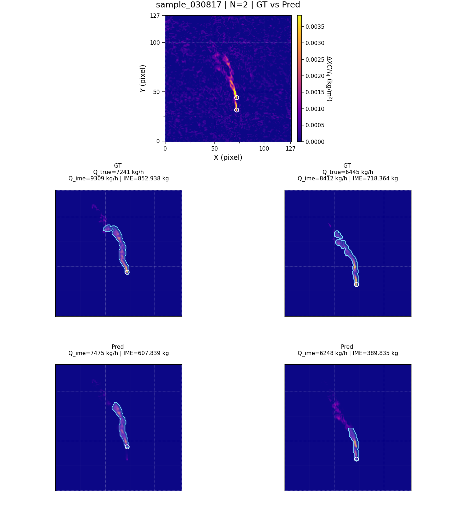
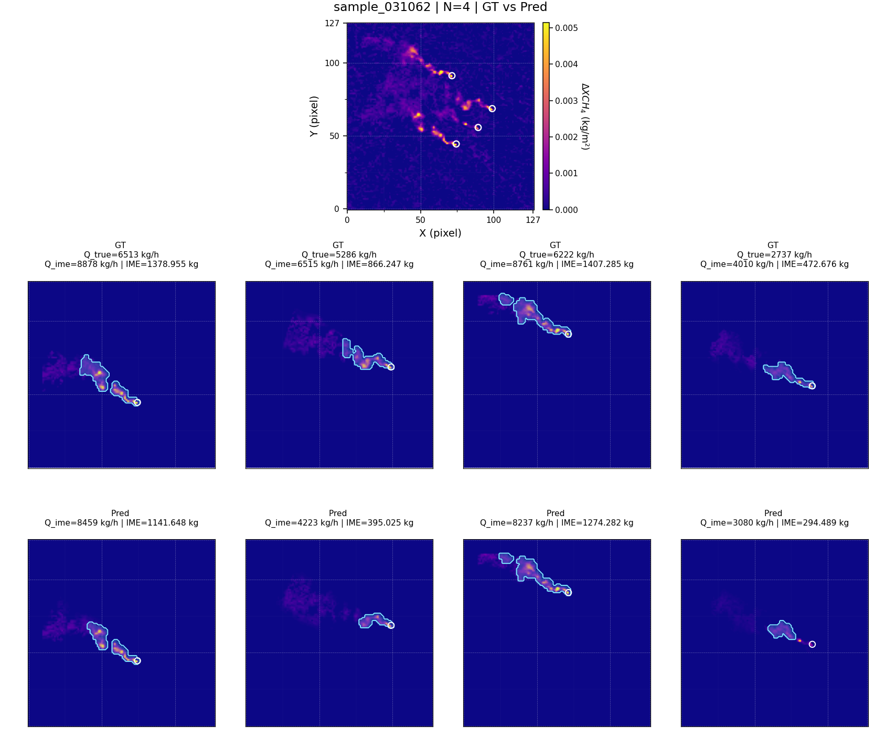
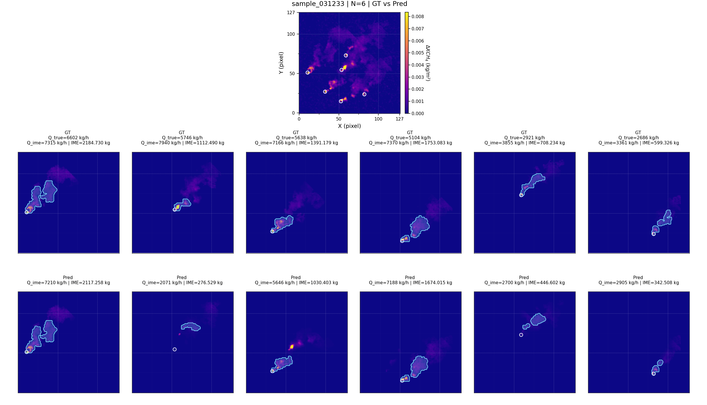
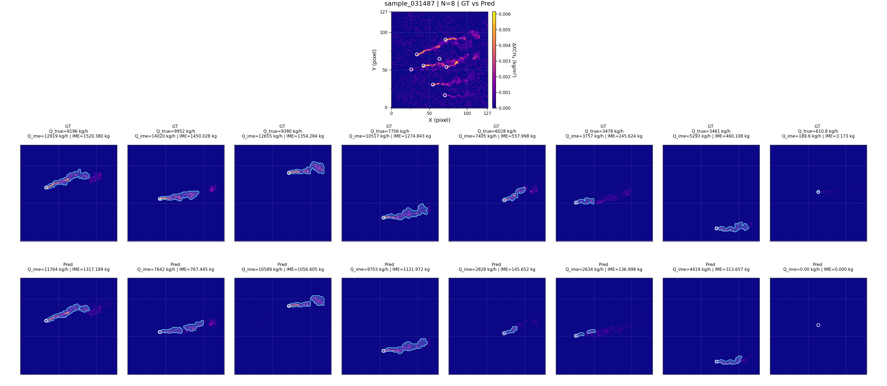

# Deep Learning-Based Separation and Quantification of Overlapping Methane Plumes

Main implementation for the paper **"Deep Learning-Based Separation and Quantification of Overlapping Methane Plumes from Satellite Observations"**.

The workflow consists of three standalone Python scripts: train a spatial-attention U-Net 3+ model, evaluate plume separation, and estimate individual source emission rates using integrated mass enhancement (IME).

## 1. Model training

**Script:** [Spatial-attention U-Net 3+ for methane plume separation(train).py](Spatial-attention%20U-Net%203%2B%20for%20methane%20plume%20separation%28train%29.py)

Builds and trains a U-Net 3+ model with spatial attention. The model predicts per-source contribution weights and mask logits. Hungarian matching aligns predicted slots with labeled sources; training uses contribution and mask losses.

- **Input:** Training and validation NPZ files containing combined methane enhancement maps and per-source contribution labels.
- **Output:** `best.pt`, per-epoch checkpoints (`epoch_XXX.pt`), and `exp_config.json` in `OUT_CKPT`.
- **Configure:** Set `DATA_ROOT` and `OUT_ROOT`, and replace the `your_output_path` subdirectory in `OUT_CKPT`. Leave `PRETRAIN_CKPT = None` for training from scratch, or provide a compatible checkpoint to initialize model weights. Optimizer state is not restored.

## 2. Plume separation and evaluation

**Script:** [overlap_plumes_separation_spatial_attention(test).py](overlap_plumes_separation_spatial_attention%28test%29.py)

Loads the best trained model and evaluates labeled test samples with 2-8 point sources. It matches predicted and reference components, computes mask-based separation metrics, and exports the information needed for subsequent IME estimation.

- **Input:** The labeled test set and the trained `best.pt` checkpoint.
- **Output:**
  - `ALL_GRIDS/N_*/`: Combined-plume, ground-truth, and predicted separation figures.
  - `RESULT_BUNDLES_FOR_IME/N_*/`: NPZ bundles containing separated components, source metadata, matching results, and original sample fields.
  - `metrics_all.csv`, `evaluation_report.txt`, and `evaluation_report.xlsx`: Detailed metrics and summaries by source count, including precision, recall, F1, IoU, and Dice.
- **Configure:** Set `DATA_ROOT`, `CKPT_PATH`, and `OUT_DIR`.

## 3. IME emission-rate estimation

**Script:** [Q_estimation_of_separated_plumes_IME.py](Q_estimation_of_separated_plumes_IME.py)

Extracts source-specific plume masks and estimates emission rates from the separated components using IME, effective wind speed, and plume length. It also compares estimated rates with reference rates derived from `scale_list`.

- **Input:** `RESULT_BUNDLES_FOR_IME` from the test script and matching test-set labels containing `u10_list` wind speeds.
- **Output:**
  - `PER_SAMPLE_MASK_PREVIEW/N_*/`: Plume-mask figures with IME and emission-rate annotations.
  - `PER_SAMPLE_Q_FIGS/N_*/`: Per-sample separation and quantification figures.
  - `IME_Q_all_components.csv`, `IME_Q_sample_mean.csv`, `IME_Q_error_by_N.csv`, and `IME_Q_report.txt`: Detailed estimates and statistical summaries.
- **Configure:** Set `INPUT_BUNDLE_DIR`, `TEST_LABEL_DIR`, and `OUTPUT_DIR`. This script does not generate `SUMMARY_PLOTS`.

The supplied configuration uses 60 m pixels, `Ueff = 0.4535 * U10 + 0.6541`, and `Q_GT = 3600 * scale_list` in kg/h. Plume components must be in kg/m², and wind speeds in m/s. Check that these settings match the dataset being evaluated.

## Example separation and quantification results

Illustrative test examples with **N = 2, 4, 6, and 8** point sources. Each figure shows the combined methane plume, ground-truth (GT) and predicted (Pred) components, plume masks, and IME emission-rate estimates. These selected examples are for visualization, not a summary of performance over the full test set. Click an image to view it at full resolution.

### N = 2 — sample_030817

[](examples/N_2.png)

### N = 4 — sample_031062

[](examples/N_4.png)

### N = 6 — sample_031233

[](examples/N_6.png)

### N = 8 — sample_031487

[](examples/N_8.png)

## Dataset download and reproduction

The dataset is publicly available on **Figshare** under the **CC BY 4.0** license:

- **Dataset and downloads:** [10.6084/m9.figshare.33733438](https://doi.org/10.6084/m9.figshare.33733438)
- **Published version 1:** [10.6084/m9.figshare.33733438.v1](https://doi.org/10.6084/m9.figshare.33733438.v1)

The release contains 29 binary archive parts and 6 supporting files. Download all parts (`paper_dataset_complete.zip.part001` through `.part029`), `parts_manifest.json`, and `reassemble_dataset.py` into the same folder. Run:

```bash
python reassemble_dataset.py
```

The script verifies the SHA-256 checksums and restores `paper_dataset_complete.zip`. Extract the restored ZIP normally; the individual parts cannot be extracted separately. See `DOWNLOAD_INSTRUCTIONS.md` in the Figshare record for details.

### Archive and checks

- Archive: `paper_dataset_complete.zip`
- Archive size: **15,219,652,224 bytes (15.22 GB; 14.17 GiB)**
- Uncompressed file content: **14.15 GiB**, plus filesystem overhead.
- Files: **96,601**
- SHA-256: `6be7f3b96f78d7a934c99d2d7c4af57daf7e12080510598b1acd20cdd1301645`

All input and label filenames match within each split, and all ZIP entries passed full CRC verification. These checks verify packaging and file pairing; they do not establish that the published scientific results have been reproduced.

The release package also includes `SHA256SUMS.txt`, `dataset_inventory.json`, and `DATASET_README.md`. Keep approximately 50 GB or more free for the downloaded parts, restored ZIP, and extracted data, with additional space for training and prediction outputs.

### Dataset contents

| Dataset directory | Split | Input NPZ files | Label NPZ files | Preview PNG files |
| --- | --- | ---: | ---: | ---: |
| `overlapping_plumes(2-8)-V2` | Training | 28,000 | 28,000 | 28,000 |
| `overlapping_plumes(2-8)-V2` | Validation | 2,800 | 2,800 | 2,800 |
| `overlapping_plumes(2-8)-V2` | Test | 700 | 700 | 700 |
| `overlapping_plumes(2-8)-V2_Add_S10` | Test with additional wind metadata | 700 | 700 | 700 |

Validation inputs are included in this rebuilt archive. The two test directories are versions of the same test subset, not 1,400 independent test samples. The root includes `Dataset Documentation.txt`; `images_png` files are visual previews and are not read by the scripts.

### Set paths after extraction

Let `<EXTRACTED_ROOT>` denote the directory directly containing the two dataset folders. Replace it with the actual local path.

1. **Train:** Set `DATA_ROOT` to `<EXTRACTED_ROOT>/overlapping_plumes(2-8)-V2`; configure the training output paths.
2. **Test separation:** Set `DATA_ROOT` to `<EXTRACTED_ROOT>/overlapping_plumes(2-8)-V2_Add_S10`, `CKPT_PATH` to the trained `best.pt`, and `OUT_DIR` to the test output directory.
3. **Quantify emissions:** Set `INPUT_BUNDLE_DIR` to `<TEST_OUTPUT>/RESULT_BUNDLES_FOR_IME`, `TEST_LABEL_DIR` to `<EXTRACTED_ROOT>/overlapping_plumes(2-8)-V2_Add_S10/test_dataset/labels`, and `OUTPUT_DIR` to the quantification output directory.

The IME script reads `u10_list` from the matching wind-enriched test labels and `scale_list` from result bundles. Preserve sample IDs and source ordering throughout the workflow.

No trained checkpoint is included in the dataset archive. Readers can train a model with the provided splits, or use a compatible author-provided `best.pt` when made available. Retraining does not guarantee identical numerical results to the paper; the exact checkpoint, software versions, and experimental settings should accompany any claim of reproducing the reported inference results.

## Data organization

```text
<DATA_ROOT>/
  training_dataset/
    combined_plumes/<sample_id>.npz
    labels/<sample_id>.npz
  validation_dataset/
    combined_plumes/<sample_id>.npz
    labels/<sample_id>.npz
  test_dataset/
    combined_plumes/<sample_id>.npz
    labels/<sample_id>.npz
```

Input and label files are paired by filename. Input files contain `combined` (or `combined_clean`) with shape `(H, W)`. Labels contain `alpha_list` with shape `(N, H, W)` and the source count `N`; spatial dimensions must match.

Test labels must also provide source coordinates and IDs: `src_xy_big_plot`, `src_xy_small_plot`, or `src_xy` with `src_id`, or `markers_xy` with `markers_id`. The supplied scripts use `plot_xy` coordinates. IME estimation additionally requires `scale_list` in the exported bundle and `u10_list` in the matching test label. Source coordinates, IDs, scaling factors, and wind speeds must follow the same source order.

## Installation and execution

Install the required packages in your Python environment:

```bash
pip install torch numpy scipy pandas matplotlib tqdm openpyxl
```

Use a PyTorch installation compatible with your hardware for GPU training. Replace the path placeholders in each script, then run:

```bash
python "Spatial-attention U-Net 3+ for methane plume separation(train).py"
python "overlap_plumes_separation_spatial_attention(test).py"
python "Q_estimation_of_separated_plumes_IME.py"
```

The test script's `CKPT_PATH` should point to the training output `best.pt`. The IME script's `INPUT_BUNDLE_DIR` should point to the test output `RESULT_BUNDLES_FOR_IME`.

